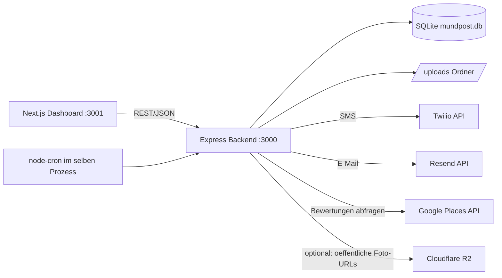

# Architektur Überblick

Gehört zu: [[Mundpost]] · [[Datenmodell]] · [[Der komplette Ablauf]]

## Komponenten

Alles läuft in **einem** Node-Prozess (Backend) + einem separaten Next.js-Prozess (Frontend). Kein Docker, keine externen Datenbankserver, keine Message-Queue — bewusst simpel gehalten für einen Ein-Personen-Betrieb/kleines Team.

## Backend-Dateien (`src/`)

| Datei | Zweck |
|---|---|
| `index.ts` | Express-App-Setup, Middleware, Router-Einbindung, Server-Start, Cron-Start |
| `db.ts` | Komplette Datenzugriffsschicht (siehe [[Datenmodell]]) — ersetzt Prisma |
| `routes/businesses.ts` | Betrieb anlegen/abrufen, Google-Place-Suche |
| `routes/customers.ts` | Kunden auflisten, CSV-Import, löschen |
| `routes/reviewRequests.ts` | Bewertungsanfragen anlegen/auflisten, Opt-out |
| `routes/photos.ts` | Foto-Upload, Schild-Position, personalisierte Vorschau |
| `routes/setup.ts` | Alle `/api/setup/test-*`-Endpunkte zum manuellen Testen |
| `services/reviewQueue.ts` | Herzstück: verarbeitet fällige Anfragen, personalisiert Foto, sendet |
| `services/reviewMetrics.ts` | Täglicher Abgleich mit Google Places (Sternebewertung) |
| `services/cronJobs.ts` | Zeitplan der beiden Cron-Jobs |
| `services/messaging.ts` | Twilio/Resend-Clients (lazy-loaded), Nachrichtentexte |
| `services/photoPersonalization.ts` | Canvas-Rendering: Name aufs Schild (siehe [[Foto-Personalisierung]]) |
| `services/fileStorage.ts` | Lokales Speichern unter `/uploads` + optional Cloudflare R2 |
| `services/csvImport.ts` | CSV-Parsing für Kundenimport |
| `services/googlePlaces.ts` | Google-Places-Suche, Bewertungslink-Generierung |

## Warum SQLite statt Prisma/PostgreSQL?

Ursprünglich war Prisma + PostgreSQL geplant, aber der Prisma-Engine-Download wurde vom Netzwerk blockiert (403). Lösung: komplette Datenzugriffsschicht händisch mit `node:sqlite` (in Node 22 eingebaut) neu geschrieben — läuft komplett offline, keine Downloads, keine Server-Installation. Nachteil: kein ORM-Komfort (Migrations, Typsicherheit) — dafür funktioniert es garantiert überall, wo Node 22 läuft.

## Lazy-Loading von API-Keys

Alle Zugangsdaten (`getApiKey()`, `getTwilio()`, `getResend()` in `messaging.ts`) werden **zur Laufzeit innerhalb der Funktionen** gelesen, nicht beim Modul-Import. Grund: verhindert, dass Keys als "fehlend" gelten, nur weil `.env` nach dem ersten Modul-Import geladen wurde (Reihenfolge-Problem).

## Frontend (`frontend/`)

- Next.js App Router, Tailwind-artiges Design-System (`app/globals.css` mit Farbtokens)
- `app/dashboard/page.tsx` — Kachel-Übersicht (Bewertungen, Ø-Sterne, Tageslimit) + Verlaufs-Chart (Recharts)
- `app/dashboard/reviews/page.tsx` — Liste aller Bewertungsanfragen mit Status-Badges
- `app/dashboard/customers/page.tsx` — CSV-Import-UI, Kundenliste, Opt-out-Status
- Farbpalette ist bewusst gegen WCAG-Kontrast und Farbenblindheit (CVD) geprüft

## Ports & lokale URLs

| Was | URL |
|---|---|
| Backend API | http://localhost:3000 |
| Frontend Dashboard | http://localhost:3001 |
| Hochgeladene Fotos | http://localhost:3000/uploads/... |
