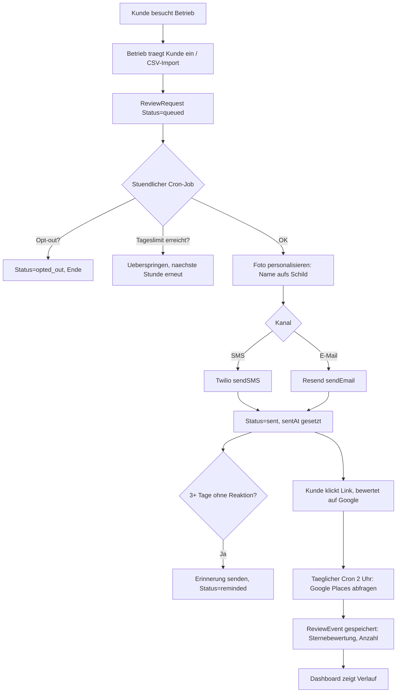

# Der komplette Ablauf

Gehört zu: [[Mundpost]] · [[Neuen Kunden anlegen]] · [[Architektur Überblick]]

Von "Kunde besucht Salon" bis "Sternebewertung im Dashboard sichtbar" — jeder Schritt mit zuständiger Datei.

## Schritt-für-Schritt mit Code-Stellen

1. **Kunde wird angelegt** — `POST .../customers/import` (CSV) oder manuell → `src/routes/customers.ts`, Tabelle `Customer` in [[Datenmodell]]

2. **Bewertungsanfrage wird erstellt** — `POST .../review-requests` → Status `queued` in Tabelle `ReviewRequest` (`src/routes/reviewRequests.ts`)

3. **Stündlicher Cron-Job** (`src/services/cronJobs.ts`, `0 * * * *`) ruft `processReviewQueue()` in `src/services/reviewQueue.ts` auf:
   - holt bis zu 100 fällige Anfragen (`reviewRequests.listDue()`)
   - **Opt-out-Check**: Kunde hat sich abgemeldet? → Status `opted_out`, überspringen
   - **Tageslimit-Check**: `dailyBatchLimit` des Betriebs schon erreicht? → überspringen, nächste Stunde erneut versuchen
   - **Foto personalisieren**: `photoUrlFor()` schreibt den Vornamen aufs Inhaberfoto (siehe [[Foto-Personalisierung]])
   - **Versand**: je nach `channel` per Twilio (SMS) oder Resend (E-Mail), inkl. personalisiertem Foto
   - bei Erfolg: Status `sent` + `sentAt`

4. **Erinnerung** (gleicher Cron-Lauf): Anfragen, die vor 3+ Tagen gesendet wurden und noch keine Erinnerung bekamen (`listReminderCandidates`) → zweite Nachricht, Status `reminded`

5. **Kunde bewertet** (oder auch nicht) — passiert komplett auf Googles Seite, Mundpost bekommt das nicht direkt mit (kein Webhook von Google)

6. **Täglicher Cron um 2 Uhr** (`updateReviewMetrics()` in `src/services/reviewMetrics.ts`) fragt die Google Places API nach der aktuellen Sternebewertung + Anzahl Bewertungen des Betriebs ab und speichert einen `ReviewEvent`-Datensatz → so entsteht der Verlauf im Dashboard-Chart

7. **Opt-out durch den Kunden** — `PATCH .../review-requests/:id/opt-out` markiert den Kunden dauerhaft (`Customer.optOut = 1`), alle künftigen Anfragen an ihn werden übersprungen

## Was NICHT automatisch passiert

- Mundpost weiß **nicht**, ob/wie ein Kunde tatsächlich bewertet hat (Google gibt das nicht pro Person frei) — nur die **aggregierte** Sternebewertung des Betriebs wird getrackt
- Es gibt keinen automatischen Trigger "Kunde hat gerade bezahlt" → das Anlegen eines `Customer` + `ReviewRequest` muss der Betrieb (oder eine Kassenanbindung) selbst auslösen
